# King County Food Safety: Analysis & Violation Prediction

Using historical inspection data to help health inspectors prioritize what to check next.

Inspection records tell you what a restaurant did wrong last time. 
This project asks a different question: what's it likely to do wrong next time — combining exploratory analysis with a machine learning model that predicts the most likely violation types for a restaurant's next inspection, giving inspectors a targeted checklist.

## Data Sources

- [Food Establishment Inspection Data](https://data.kingcounty.gov/Health-Wellness/Food-Establishment-Inspection-Data/r878-4sxa/about_data) — the primary dataset: inspections, violations, scores, and grades.
- [Businesses (Food) — King County](https://data.kingcounty.gov/Health/Businesses-Food-King-County/sgr5-u9rw/about_data) — merged in to recover each restaurant's latitude/longitude. Addresses still missing after the merge were filled in using [GeoPy](https://geopy.readthedocs.io/).
- [Zip code population data](https://www.zip-codes.com/city/wa-seattle.asp#zipcodes) — used to compute restaurant density per zip code.

After merging, the dataset covers **12,261 unique restaurants**.

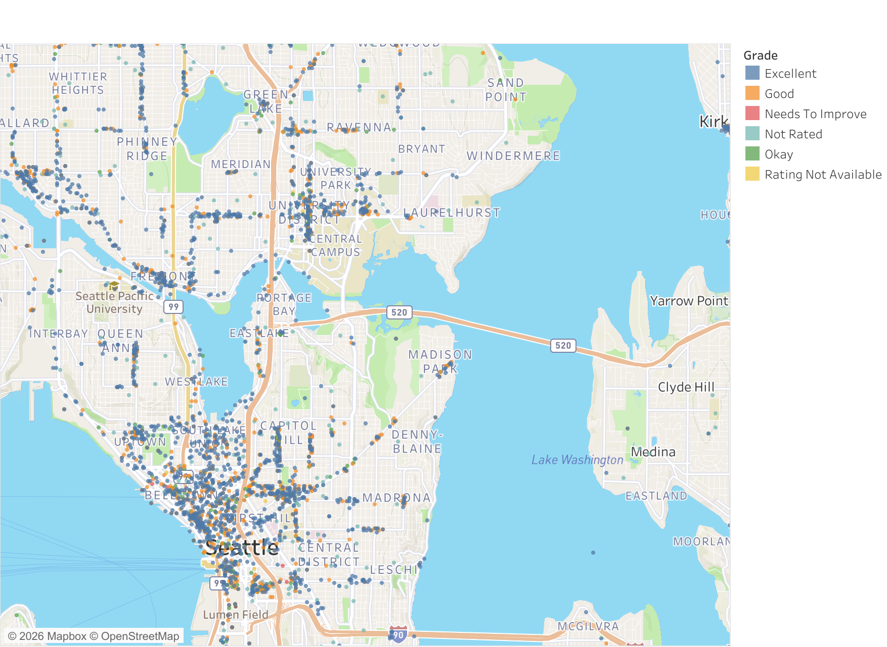

## Exploratory Findings

**Higher-risk restaurants earn fewer "Excellent" grades.** Of the three risk categories, Risk Level 3 has the lowest share of Excellent grades (58%, vs. 77% for Risk Levels 1 and 2) — risk category is a real, visible signal in the grading outcome, not just a label.

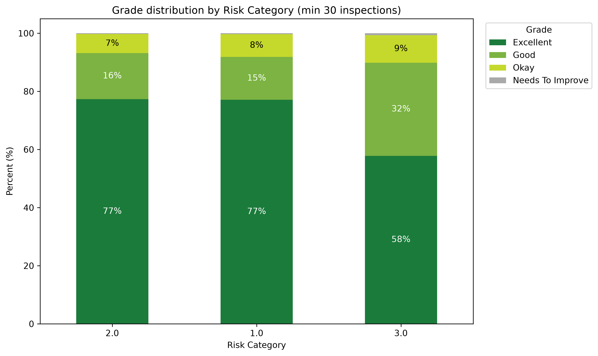

**The most common violations, overall:**

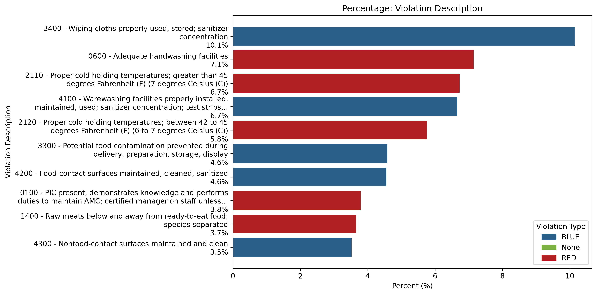

**41.24% of restaurants have at least one repeat violation** — the same issue cited again at a later inspection. Repeat violations skew toward the lower-severity **blue** category rather than the higher-severity **red** category.

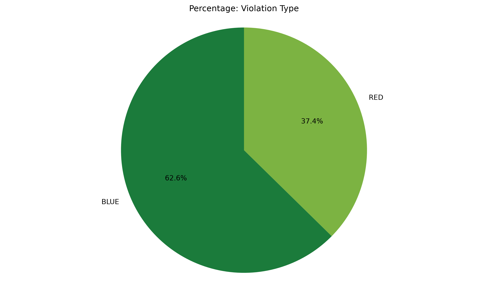

**Restaurants with repeat violations score worse per inspection**, on average, than restaurants without repeat violations.

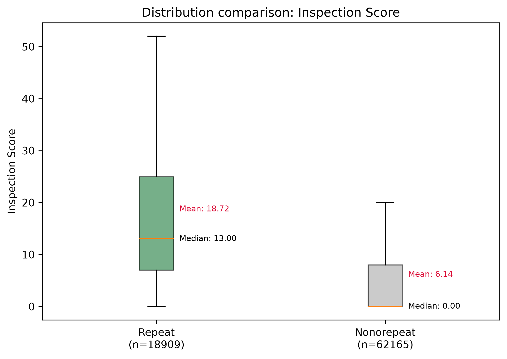

**Restaurant density varies sharply by zip code.** Combining the inspection data with zip code population figures shows which areas are under-served relative to population — the regions below the dashed line have lower restaurant density than expected. ([Reference: King County rating system](https://kingcounty.gov/en/dept/dph/health-safety/food-safety/inspection-rating-system/rating-system))

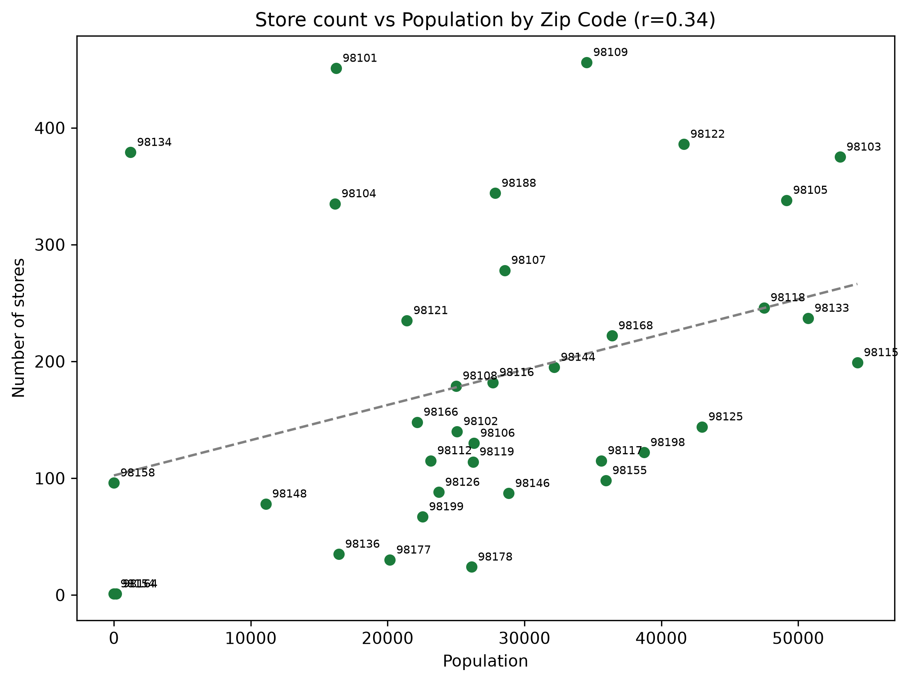

**Business growth has slowed since its 2022 peak.** Most food business categories are still expanding, but at a lower rate than in 2022. (2026 is excluded from this trend since the year isn't complete yet.)

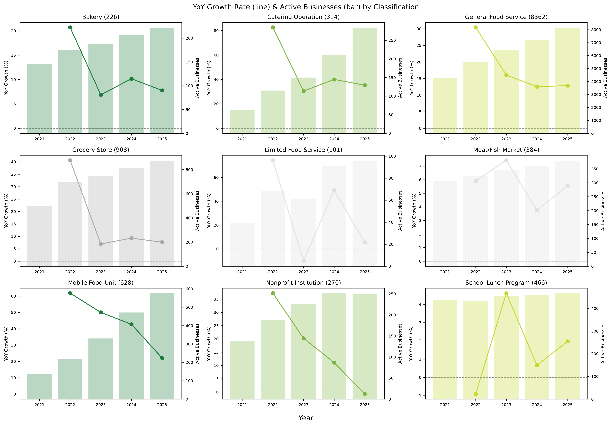

**47 restaurants** currently hold a "Needs To Improve" grade. Relative to category size, **Mobile Food Units have the highest rate** of receiving this grade among all classifications.

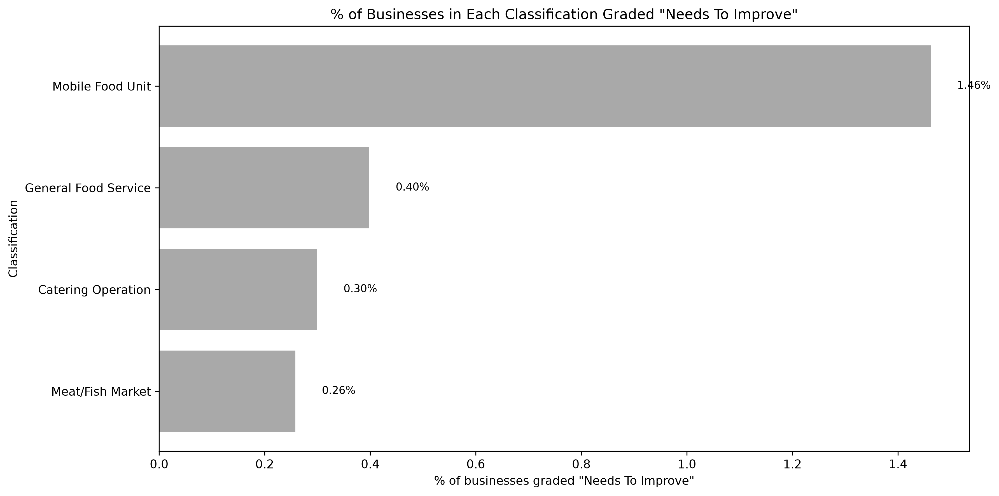

Their violation profile also looks different from the citywide pattern: **7 of their top 10 violation types are "red"** (higher severity), compared to a much more blue-leaning mix citywide.

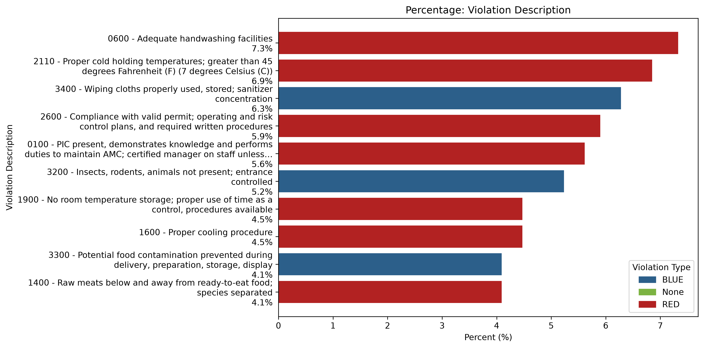

They're also far less likely to resolve those violations: only **12.8%** of "Needs To Improve" restaurants have fixed their violations, compared to **58.8%** fixed rate across all restaurants — a large gap, not a marginal one.

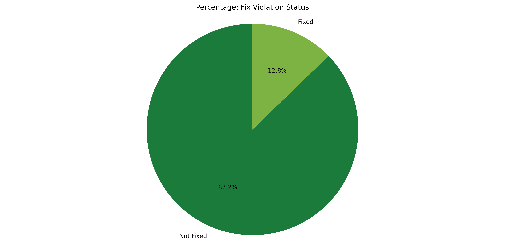
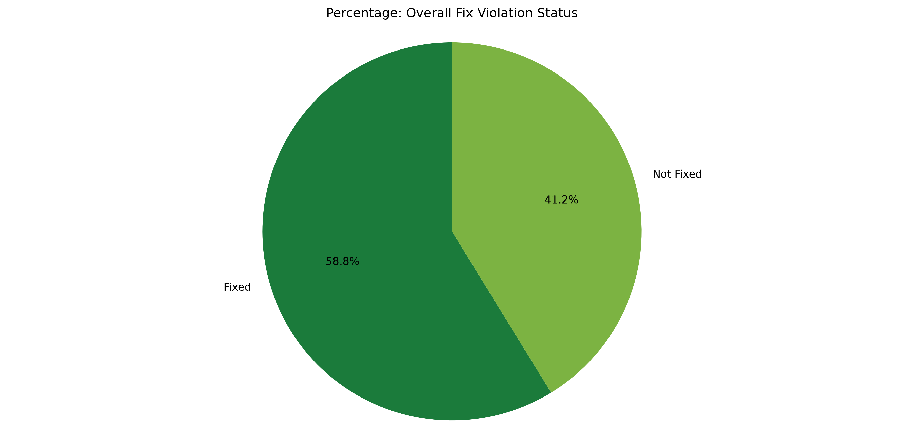

## Machine Learning: Predicting Violation Types

**Goal**: for each restaurant's next Routine Inspection, predict which of the 53 known violation types are most likely to occur, and surface the top 3 as a checklist for the inspector — not a replacement for a full inspection, but a way to prioritize attention.

**Approach**: a single shared model, trained on one row per (inspection, candidate violation type) pair, using only information available *before* that inspection (a business's own violation history, how common each violation type is citywide, days since last inspection, and its Risk Category, Classification, and Seating Range). The train/test split is chronological, so the model is always evaluated on inspections that happen after the ones it trained on.

**Evaluation**: Precision@3, Recall@3, and F1@3 — of the 3 violation types suggested, how many were actually cited (precision); of the violations that did occur, how many were caught in the top 3 (recall); and F1@3 balances the two into a single score, since a model can't win just by maximizing one at the other's expense.

### Hyper-parameter tuning

Tuned Random Forest and XGBoost with a small grid search, scored on **validation log loss** rather than AUC — log loss is calibration-aware, which matters here since the P(any) gate multiplies 53 individual probabilities together, so miscalibrated values would distort that aggregation even if they're correctly *ranked*. Evaluated on an internal validation split (the last 20% of the training period, chronologically) rather than full cross-validation, given the size of the data (2.3M+ training rows).

| Model | Parameters searched | Best found | Validation log loss |
|---|---|---|---|
| Random Forest | `n_estimators` (300, 600), `max_depth` (12, 16) | `n_estimators=600, max_depth=16` | 0.0737 |
| XGBoost | `max_depth` (6, 8), `learning_rate` (0.05, 0.1) | `max_depth=6, learning_rate=0.05` | 0.0732 |

Both searches were intentionally small — a handful of hand-picked candidates, not an exhaustive grid — and improved F1@3 by only a few thousandths relative to the untuned defaults, which is reflected in the comparison below.

### Model comparison

| Model | Precision@3 | Recall@3 | F1@3 |
|---|---|---|---|
| Random guess (3 of 53) | 0.017 | 0.056 | 0.027 |
| Always suggest the 3 most common violations | 0.067 | 0.215 | 0.102 |
| Logistic Regression | 0.145 | 0.197 | 0.167 |
| Random Forest (tuned) | 0.151 | 0.223 | 0.180 |
| **XGBoost (tuned)** | **0.165** | 0.202 | **0.182** |

- **Random Forest** clearly beats both baselines: Precision@3 of 0.151 is roughly **8.9x random guessing** and **~2.3x the naive "always suggest the most common violations"** baseline, and it has the best recall/catch-rate (0.223 / 0.658) of the three models.
- **XGBoost** has the best overall F1@3 (0.182) — highest Precision@3 (0.165, ~9.7x random guessing and ~2.5x the popularity baseline) and lowest false-alarm rate (0.213), trading away some recall/catch-rate compared to Random Forest.

**What actually drives the prediction** (Random Forest feature importance):
1. Citywide base rate of the violation type — **31%**
2. Whether that violation happened at the restaurant's *previous* inspection — **19%**
3. How often that violation has happened at this restaurant historically — **17%**

Together, a restaurant's own violation history accounts for **36%** of the model's total feature importance — slightly more than the citywide baseline alone, rather than dominating it.

**A second decision, before the top-3 list**: not every inspection should get a checklist — a restaurant with a clean history usually doesn't need one. Before ranking violation types, the model first estimates the probability that *any* violation will occur at all, and only issues a top-3 list when that probability crosses a threshold — otherwise inspectors see nothing extra for that visit. This gate has an AUC of ~0.75, meaning it meaningfully separates at-risk from clean inspections, though it isn't perfect — some false alarms and some misses are inevitable trade-offs, tuned via the threshold.

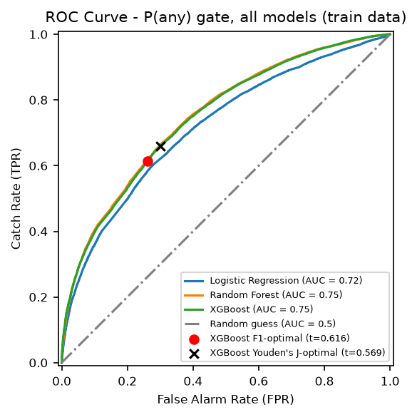

## Future Works

- Revisit the "how many suggestions to show" trade-off (currently top 3) with input from an actual health inspector.
